# edu-trip 系统设计文档

> 文档版本：1.0  
> 对应项目版本：1.4  
> 生成日期：2026-07-16  
> 设计依据：当前仓库代码和配置；没有数据库迁移脚本的部分按实体映射推断

## 1. 项目概述

`edu-trip` 是面向博物馆研学业务的单体后端服务，服务对象包括：

- 管理端：维护博物馆、用户、角色权限、活动、订单、评价、文件和对账。
- 微信小程序端：获取 OpenID、登记游客或团队、浏览活动、预约下单、支付、查看订单和提交评价。
- 银联商务：小程序支付、订单查询、关单、退款、退款查询和异步通知。
- 运维与财务人员：导入银联交易流水，执行按博物馆和时间区间的异常对账。

系统核心目标是保证“活动场次容量、订单支付状态、退款状态、核销状态、银联账务”之间的一致性和可追溯性。

## 2. 技术架构

### 2.1 技术栈

| 分类 | 技术 | 当前版本/实现 |
|---|---|---|
| 语言 | Java | 8 |
| 应用框架 | Spring Boot | 2.6.3 |
| Web | Spring MVC | REST Controller |
| ORM | MyBatis-Plus | 3.3.2 |
| 数据源 | dynamic-datasource + Druid | 单主库配置，可扩展多数据源 |
| 数据库 | MySQL | `edu_trip` |
| 缓存与消息 | Redis + Lettuce | Key 过期事件、分布式锁、Pub/Sub |
| 认证授权 | Sa-Token | 1.44.0 |
| 接口文档 | Springfox Swagger 2 | 2.9.2 |
| Excel | EasyExcel、Hutool POI、Apache POI | 游客导入、银联流水导入 |
| HTTP 客户端 | Apache HttpClient、OkHttp | 银联和微信外部接口 |
| JSON | Fastjson2、Jackson、Hutool JSON | 多套 JSON 工具并存 |
| 构建 | Maven | Spring Boot Maven Plugin |

### 2.2 逻辑架构

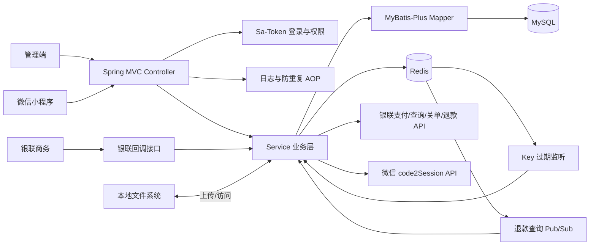

### 2.3 分层职责

| 层 | 目录 | 职责 |
|---|---|---|
| Controller | `system/controller`、`trip/controller` | 路由、参数初检、鉴权注解、统一响应 |
| Service | `system/service/impl`、`trip/service/impl` | 业务校验、事务、状态机、外部系统编排 |
| Mapper | `system/mapper`、`trip/mapper` | MyBatis-Plus CRUD 和少量复杂 SQL |
| Entity | `system/entity`、`trip/entity` | 数据库实体和部分查询回填对象 |
| VO | `vo/**` | 查询、下单、核销、登录和对账请求/响应模型 |
| Config | `config/**` | 数据源、Redis、Sa-Token、线程池、Swagger、CORS、异常、AOP |
| Util | `util/**` | Redis、编号生成、时间、Excel Listener、脱敏序列化器 |

## 3. 功能模块设计

### 3.1 系统与权限模块

包含用户、角色、菜单、用户角色、角色菜单、博物馆、文件、操作日志、异常记录。

权限模型采用标准 RBAC：

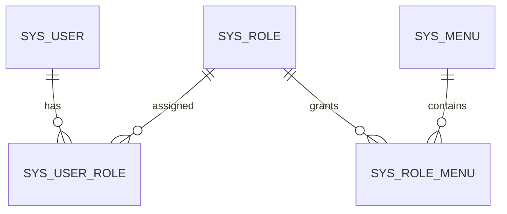

登录成功后：

1. 根据用户名查询 `sys_user`。
2. 使用用户盐对提交密码执行 AES 加密并与数据库值比较。
3. 检查用户启用状态。
4. Sa-Token 建立登录会话。
5. Session 保存 `userId`。
6. 返回 Token、角色 ID 列表和博物馆 ID。

权限码来自 `sys_menu.perms`，通过用户角色和角色菜单关系动态查询。

### 3.2 博物馆模块

博物馆是业务数据的主要租户/归属维度。活动、游客、订单、皮肤、活动类型、标签、文件和银联对账均通过 `museum_id` 关联。

博物馆同时保存银联配置：

- `mid`：银联商户号，必须唯一。
- `tid`：银联终端号。
- `id_card_verify_enabled`：身份证验证策略开关。
- `status`：启用/禁用。

当前系统不是严格的数据库级多租户方案，而是在业务查询中显式加入 `museum_id` 条件。

### 3.3 活动模块

活动由主表和场次表组成：

- 活动主表：名称、类型、价格、博物馆、有效日期、参与形式、年龄分类、标签、展示资源和上下架状态。
- 活动场次：开始时间、结束时间、场次容量、状态。

活动设计规则：

- 新建活动默认禁用，需要通过状态接口发布。
- 已建立活动的类型、单价、博物馆、起止日期等关键字段不可直接修改，保证历史订单可追溯。
- 删除为逻辑删除，并同步禁用所有场次。
- 小程序只查询启用、未删除的活动和启用场次。
- `tag_ids` 当前为英文逗号分隔字符串，而不是关系表。
- 场次不存具体日期；活动日期范围在主表，场次仅保存每天的时间段。

### 3.4 游客与团队模块

个人游客与团队是两种下单主体：

- 个人订单关联 `visitor_id`。
- 团队订单关联 `team_id` 和 `batch_no`。
- 团队下可按批次维护游客名单。

游客保存包含数据治理逻辑：

- 手机号和身份证格式校验。
- 身份证地址码、出生日期、校验码校验。
- 自动计算省、市、性别和年龄。
- 无身份证时按手机号段补充省市。
- 相同 OpenID 的有效记录合并更新。
- 相同 OpenID 的逻辑删除记录优先恢复。

团队也采用 OpenID 唯一及逻辑恢复策略，并以数据库唯一索引作为并发兜底。

### 3.5 订单与支付模块

订单采用“主订单 + 可退款最小子订单”模型：

- 主订单保存总金额、总数量、下单主体、支付状态、核销状态和银联订单号。
- 每购买一个活动名额生成一条子订单。
- 多数量购买会拆成多条相同活动、场次的子订单。
- 单笔退款以子订单为最小单位。
- 全额退款将全部子订单绑定到同一个退款业务号。

这种设计便于：

- 逐个名额退款。
- 按活动统计有效核销量。
- 精确计算退款数量和金额。
- 对账时区分有效子订单与已退款子订单。

### 3.6 评价模块

评价关联主订单，一个订单只允许一条未删除评价。查询时通过订单详情和活动表回填博物馆、活动 ID 和活动名称。

### 3.7 文件模块

文件上传流程：

1. 校验文件非空、文件名不含路径穿越字符。
2. 以 `yyyyMMdd` 创建日期目录。
3. 使用 UUID 生成实际文件名。
4. 保存到 `edu.file.upload-path`。
5. 写入 `sys_file` 元数据。
6. 返回基于文件 ID 的访问地址。

文件访问接口再次校验数据库路径必须位于配置根目录，降低任意文件读取风险。

### 3.8 对账模块

对账以博物馆、开始日期、结束日期为条件，统一核对：

- 系统支付、预约、核销和退款事件。
- 银联核对区间内消费和退款流水。
- 区间外历史消费和退款流水。
- 系统有效核销金额。
- 按活动和核销月份汇总的账单。

对账输出固定异常分组，且没有数据的分类也返回空数组，方便前端稳定渲染。

同一订单可以命中多个异常标签，但只有一个主分类承担金额调整，避免重复加减。最终通过：

`系统有效核销金额 - 调整后银联净额 = balanceDifference`

并结合未分类数量和重复分类数量判断 `balanced`。

## 4. 数据模型

### 4.1 核心 ER 图

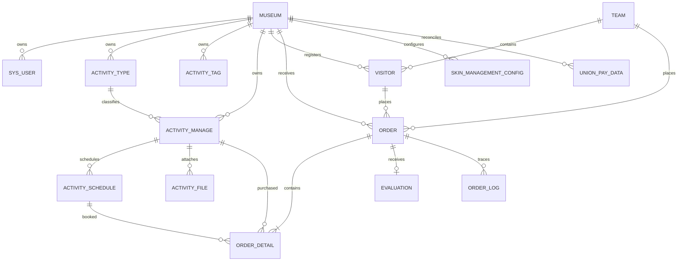

### 4.2 数据表清单

下表名称按 MyBatis-Plus 默认命名及显式 `@TableName` 推断。

| 表 | 主键 | 主要关系 | 用途 |
|---|---|---|---|
| `Museum` | `id` | 被多个业务表引用 | 博物馆及银联商户配置 |
| `sys_user` | `id` | `museum_id`、用户角色 | 管理端用户 |
| `sys_role` | `id` | 用户角色、角色菜单 | 角色 |
| `sys_menu` | `id` | 角色菜单、自关联父子菜单 | 菜单与权限码 |
| `sys_user_role` | `id` | `user_id`、`role_id` | 用户角色关系 |
| `sys_role_menu` | `id` | `role_id`、`menu_id` | 角色菜单关系 |
| `sys_file` | `id` | 被业务 URL 引用 | 文件元数据 |
| `sys_log` | `id` | 用户名弱关联 | 操作日志 |
| `sys_exception` | `id` | 无强关联 | 全局异常记录 |
| `activity_type` | `id` | `museum_id` | 活动类型 |
| `activity_tag` | `id` | `museum_id` | 活动标签 |
| `activity_manage` | `id` | 类型、博物馆、场次、订单详情 | 活动主数据 |
| `activity_schedule` | `id` | `activity_id` | 每日场次 |
| `activity_file` | `id` | 活动、博物馆 | 活动资料 |
| `skin_management_config` | `id` | `museum_id` | 小程序主题皮肤 |
| `team` | `id` | 游客、订单 | 团队主体 |
| `visitor` | `id` | 博物馆、团队、订单 | 游客主体 |
| ``order`` | `id` | 博物馆、游客/团队、子订单、评价 | 主订单 |
| `order_detail` | `id` | 主订单、活动、场次 | 可退款最小订单单元 |
| `order_log` | `id` | 主订单、子订单 | 订单状态、退款、核销审计 |
| `evaluation` | `id` | `order_id` | 订单评价 |
| `union_pay_data` | `id` | `mid`、`tid`、交易号 | 银联导入流水 |
| `administrative_division` | `id` | 地址码查询 | 行政区划 |
| `mobile_number_segment` | `id` | 手机号段查询 | 手机归属地 |

### 4.3 逻辑删除

以下业务表使用 `is_deleted`：

- `activity_manage`
- `activity_type`
- `activity_tag`
- `activity_file`
- `skin_management_config`
- `visitor`
- `team`
- `evaluation`

博物馆通过 `status=0` 表示禁用。订单表当前不使用逻辑删除字段。

### 4.4 审计字段

MyBatis-Plus `MyMetaObjectHandleConfig` 自动填充部分实体的 `create_time`、`update_time`、`create_by`、`update_by`。不同表的审计字段类型并不完全一致，系统表多为字符串，业务表多为 Long。

## 5. 核心业务流程

### 5.1 登录与权限

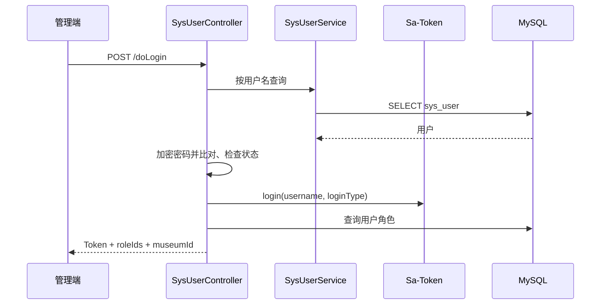

后续请求由全局拦截器检查登录，再由 `@SaCheckPermission` 检查权限码。

### 5.2 活动发布

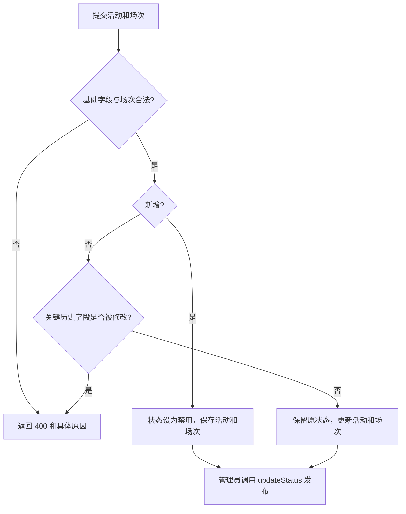

### 5.3 下单与支付

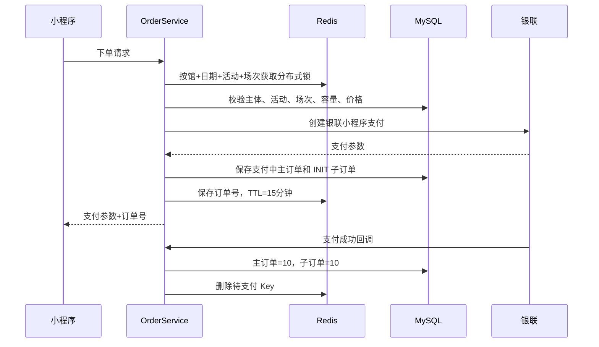

支付状态更新具有以下保护：

- 支付回调验签。
- 支付成功逻辑幂等。
- 已进入退款链路的订单不会被迟到支付回调覆盖。
- 银联主动查询确认成功时复用相同落库逻辑。
- 记录 `order_log` 便于追溯。

### 5.4 待支付超时补偿

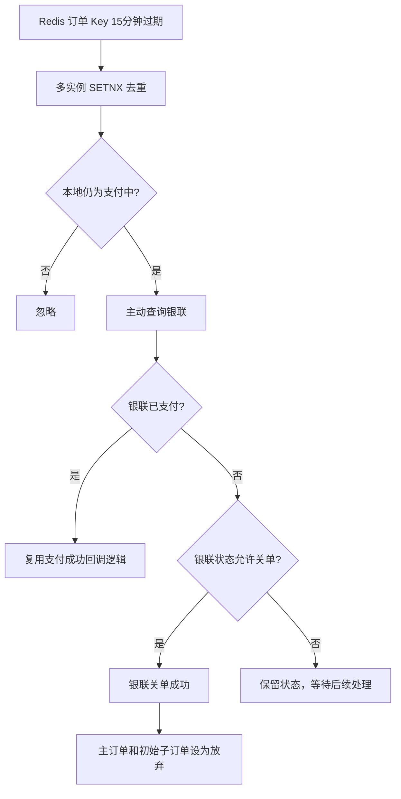

该流程依赖 Redis 开启 Keyspace Notification 的过期事件。

### 5.5 退款与退款补偿

单笔退款：

1. 定位子订单和主订单。
2. 只允许主订单支付成功或部分退款、子订单支付成功。
3. 读取订单所属博物馆的 `mid/tid`。
4. 向银联申请子订单金额退款。
5. 银联受理后，子订单和主订单进入退款中。
6. 发布 `mq_union_refund_query` 消息。
7. 等待银联退款回调或延迟查询补偿。

全额退款：

- 只允许未发生退款的支付成功订单。
- 所有子订单必须为支付成功。
- 退款前主动查询银联原支付订单。
- 银联金额必须与本地主订单金额一致。
- 全部子订单共用一个退款业务号。

退款查询消息由 Redis Pub/Sub 接收后延迟 10 分钟执行：

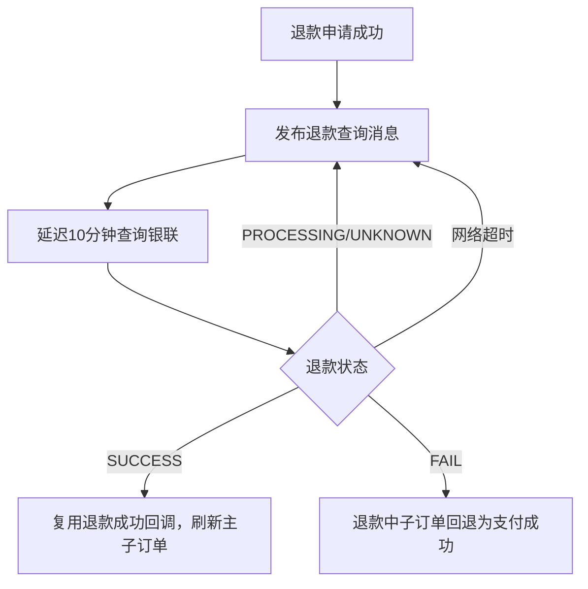

### 5.6 核销

核销只更新主订单 `is_used=1` 和 `verification_time`，但执行前严格检查全部子订单：

- 订单属于当前博物馆。
- 预约日期为当天。
- 主订单为支付成功。
- 未发生退款且未处于退款中。
- 未重复核销。
- 子订单数量完整。
- 全部子订单为支付成功。

### 5.7 对账

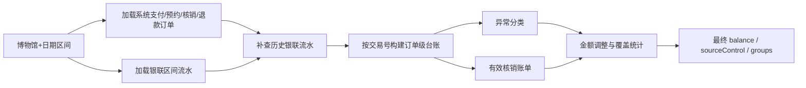

对账以 `mid + tid` 严格筛选银联流水，避免其他商户或终端数据混入。

## 6. 状态机设计

### 6.1 主订单状态机

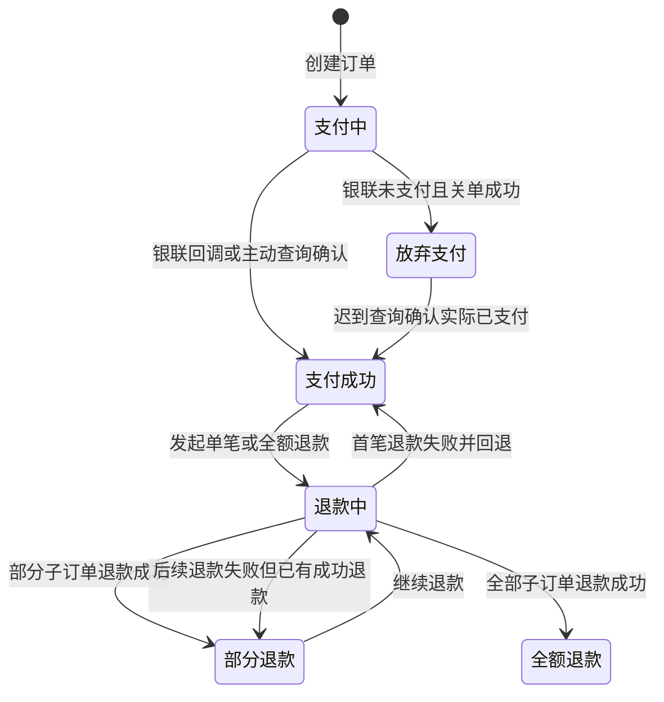

### 6.2 子订单状态机

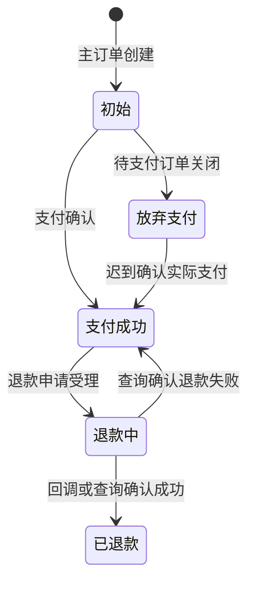

### 6.3 名额占用

场次容量统计只计算仍占用名额的主子订单组合：

- 主订单：支付中、支付成功、退款中。
- 子订单：初始、支付成功、退款中。
- 放弃支付和退款成功不再占用对应名额。

## 7. 一致性、事务与并发

### 7.1 数据库事务

以下关键操作使用 Spring 事务：

- 活动与活动场次同步保存、活动逻辑删除。
- 下单保存主订单和子订单。
- 支付成功回调。
- 退款回调和退款失败回退。
- 单笔退款、全额退款。
- 放弃支付。
- 核销。

订单日志使用 `REQUIRES_NEW`，即使主业务事务回滚，也尽量保留独立日志。

### 7.2 分布式锁

- 下单容量锁粒度：`museumId + appointmentDate + activityId + scheduleId`。
- 获取最长等待 5 秒，重试间隔 50 毫秒，锁过期 60 秒。
- 多场次按排序后的固定顺序加锁，降低死锁式互等风险。
- 释放锁使用 Lua 对比锁值后删除，防止误删其他请求获得的新锁。
- 退款回调按 `refundOrderId` 加锁，防止重复回调并发修改。

### 7.3 幂等

- 支付回调检查订单当前状态。
- 退款回调检查相同退款业务号是否已有成功子订单。
- 主订单退款金额和数量从子订单最终状态重新汇总，而不是简单累加。
- Redis 过期事件使用短期 SETNX 避免多实例重复处理。
- 登录和退款入口使用请求防重复切面。

### 7.4 最终一致性

本地订单与银联通过以下通道实现最终一致：

- 银联主动回调。
- 前端支付完成后主动确认。
- 待支付 Redis Key 过期查询。
- 退款 Pub/Sub 延迟查询。
- 管理端手工退款查询。

## 8. 安全设计

### 8.1 已实现措施

- Sa-Token 登录和细粒度权限码。
- 文件路径规范化和根目录边界检查。
- 银联回调签名验证。
- 下单金额按数据库价格重新计算。
- 核销校验博物馆归属，防止跨馆核销。
- 分布式锁和重复请求控制。
- 全局异常转换，避免直接返回大部分堆栈。
- 用户禁用后主动注销其登录状态。

### 8.2 当前风险与改进建议

以下是从当前实现识别出的设计风险，建议按优先级治理：

| 优先级 | 风险 | 建议 |
|---|---|---|
| P0 | 配置文件中存在数据库、微信、银联等敏感配置 | 立即轮换已暴露凭据，改用环境变量或密钥管理服务；仓库只保留占位符 |
| P0 | 游客手机号、身份证脱敏序列化注解被注释 | 恢复响应脱敏；管理端确需明文时使用单独受控接口 |
| P0 | 全 Controller 请求/响应日志可能记录密码、身份证、手机号、支付参数 | 建立字段级脱敏与黑名单；登录密码、Token、身份证、银行卡号、签名禁止入日志 |
| P1 | 密码使用可逆 AES | 改为 BCrypt/Argon2 等不可逆密码哈希，并设计平滑迁移 |
| P1 | CORS 允许任意来源并允许凭据 | 生产环境配置明确的 Origin 白名单 |
| P1 | 部分写操作使用 GET | 退款、全退、放弃支付、用户状态和角色更新改为 POST/PATCH，避免缓存、预取和 CSRF 风险 |
| P1 | 多个小程序业务接口公开，个别接口有“上线恢复鉴权”注释 | 明确小程序身份模型；至少校验 OpenID 与业务主体绑定，恢复临时公开接口权限 |
| P1 | Redis Pub/Sub 不持久化 | 退款补偿建议改为 Redis Stream、RabbitMQ、Kafka 或数据库任务表 |
| P1 | Redis 过期补偿依赖 Keyspace Notification | 部署时显式启用并监控；增加数据库定时扫描兜底 |
| P2 | 缺少 Bean Validation | 使用 `@Valid`、`@NotNull`、`@Pattern` 等统一参数约束 |
| P2 | Entity 直接作为写接口请求模型 | 建立专用 Command/DTO，避免前端修改审计字段、状态和敏感字段 |
| P2 | 用户保存与用户角色更新没有整体事务，且角色为空校验发生在用户写库之后 | 先完成全部校验，并用事务原子更新用户与角色关系 |
| P2 | Swagger 2 与 Spring Boot 2.6 通过兼容配置运行 | 迁移至 springdoc-openapi |
| P2 | 多套 JSON 和 HTTP 客户端并存 | 统一技术栈，减少序列化差异和维护成本 |

## 9. 异常与日志

### 9.1 全局异常

全局异常处理覆盖：

- 自定义业务异常。
- 空指针。
- Sa-Token 未登录、无权限、缺少角色。
- JSON 请求体解析错误。
- 客户端断开连接。
- IO 异常。
- 未分类异常。

异常会写入 `sys_exception`，接口返回统一 `HttpResult`。

### 9.2 操作日志

`SysLogAspect` 拦截所有 Controller：

- 所有接口打印请求和响应日志。
- 带 `@Log` 的接口额外写入 `sys_log`。
- 记录操作名称、方法、参数、返回值、耗时、IP 和用户名。

### 9.3 订单日志

`order_log` 记录：

- 主/子订单前后状态。
- 退款金额、数量前后值。
- 银联状态、错误码、交易时间。
- 请求和响应内容。
- 操作来源、操作人、IP、Trace ID。

订单日志是支付和退款问题排查的主要依据。

## 10. 配置与部署

### 10.1 Profile

| 配置 | 开发 | 生产 |
|---|---|---|
| Profile | `dev` | 启动参数指定 `prod` |
| Swagger | 开启 | 关闭 |
| 定时任务 | 关闭 | 开启 |
| Redis DB | 5 | 1 |
| 文件目录 | 本机目录 | `/www/file` |
| 订单号前缀 | `11TW_DEV` | `11TW` |

### 10.2 关键配置项

```yaml
server.port
spring.datasource.dynamic.datasource.master.*
spring.redis.*
edu.file.upload-path
edu.file.domain
edu.file.request-prefix
edu.wechat.mini-program.app-id
edu.wechat.mini-program.secret
unionPay.appletAppId
unionPay.appletAppKey
unionPay.notifySignKey
unionPay.notifyUrl
unionPay.*Url
sa-token.*
swagger.enable
scheduled.enable
code.prefix
```

### 10.3 外部依赖

- MySQL 可用，字符集和时区建议统一为 UTF-8、Asia/Shanghai。
- Redis 可用，且需要配置过期事件通知。
- 文件上传目录存在并具备读写权限。
- 服务器能访问微信和银联 API。
- 银联能访问配置的回调 URL。
- 反向代理允许最大 500 MB 上传和足够长的请求超时。

### 10.4 Redis 部署要求

订单过期监听需要 Redis 配置包含过期事件，例如：

```text
notify-keyspace-events Ex
```

多实例部署时所有实例都可能收到事件，应用依赖 SETNX 做短时去重。

### 10.5 启动与构建

```bash
mvn clean package
java -jar target/edu-trip-1.4.jar --spring.profiles.active=prod
```

生产环境不应直接使用仓库中的固定账号、密码或密钥，应通过环境变量/外部配置中心注入。

## 11. 测试设计

当前已有测试覆盖：

- 应用启动。
- 活动管理 Controller/Service。
- 订单 Controller/Service。
- 银联支付 Service。
- 对账 Service。
- 博物馆 Service。
- 全局异常。
- Sa-Token 配置。

建议补充：

- 下单并发容量测试。
- 支付回调重复、乱序和迟到测试。
- Redis 过期事件丢失后的定时扫描测试。
- 单笔退款、全退、部分退款后继续退款的状态机测试。
- 退款回调与主动查询并发测试。
- 对账每个异常分类的黄金数据集。
- 文件路径穿越、超大文件和恶意文件名测试。
- 权限矩阵自动化测试。
- PII 日志和响应脱敏测试。

## 12. 已知技术债务

- 仓库没有数据库建表和迁移脚本，无法仅凭代码验证索引、外键和唯一约束是否完整。
- `OrderDetailMapper.xml` 中存在引用旧 `product` 表和旧字段的兼容 SQL，需确认是否仍会被调用。
- `SysExceptionController`、`ActivityScheduleController`、`OrderDetailController` 为空控制器。
- `ScheduledConfig` 当前定时任务仅打印日志，没有形成订单兜底扫描。
- `pom.xml` 中测试和 Lombok 依赖存在重复声明。
- Entity 同时承担数据库模型、接口请求模型和接口响应模型。
- `tag_ids` 使用逗号字符串，不利于数据库约束与高效查询。
- `Museum` 表名显式使用首字母大写，在不同操作系统的 MySQL 表名大小写策略下可能产生兼容问题。
- 部分接口缺少细粒度权限注解，仅依赖登录校验。
- 评价查询连接多条订单详情时，理论上可能产生重复评价行，需要结合真实数据验证。

## 13. 后续演进建议

推荐按以下顺序演进：

1. 完成密钥轮换、日志脱敏、游客数据脱敏和生产 CORS 收口。
2. 补齐 Flyway/Liquibase 数据库迁移、索引与唯一约束。
3. 把支付和退款补偿迁移到持久化消息或任务表。
4. 将 Entity 与 API DTO 分离，引入 Bean Validation。
5. 为订单状态机建立集中式领域服务和状态转换校验。
6. 增加订单超时数据库扫描，避免只依赖 Redis 过期事件。
7. 将 Swagger 2 迁移到 OpenAPI 3，并由接口模型自动生成客户端。
8. 建立完整的权限矩阵、审计策略和敏感数据保留策略。

## 14. 关联文档

- [接口文档](./API_DOCUMENTATION.md)
- 运行时 Swagger：开发环境 `/doc.html` 或 `/swagger-ui.html`
